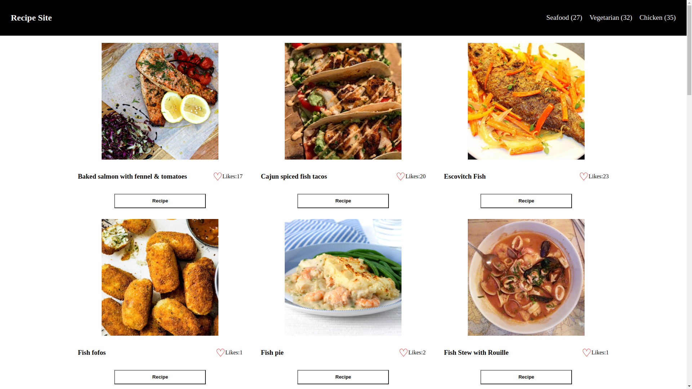

# Catalog-API-Site

A recipe catalog site, built using The Meal DB API

## Screenshot

## Built With

- JavaScript
- HTML
- CSS

## Live Demo

[Demo Link](https://cerdtruir.github.io/Catalog-API/)

## Build Instructions

Clone the repository
Install dependencies with `npm install`
Run `npm start`

## Authors

👤 **Cerdtruir**

- GitHub: [@Cerdtruir](https://github.com/Cerdtruir)

## Acknowledgements

- [The Meal DB API](https://www.themealdb.com/)
